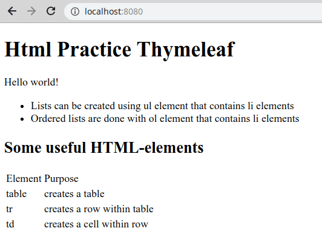

# Exercise 02 02

Implement the assignment template in the folder src/main/resources/templates/to the existing file index.htmlpage that uses h1, h2, ul, li, p, table, tr, and tdelements in a sensible way.

One possible outcome looks like the following.
htmlpractice

There are no tests in the assignment. Return the task to TMC when you have implemented the desired functionality in the task assignment.

---
