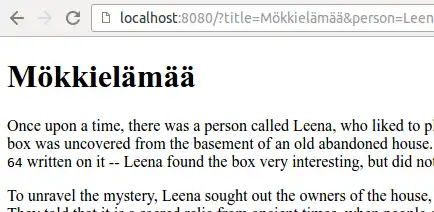

# Exercise 02 03: Hello Model

A story has been implemented in the HTML file that comes with the assignment template, which needs a title and a main
character.  Implement in packaging `_02_03_hello_model` functionality that handles requests coming to the root path and uses the parameters coming in the request `index.html`to complete the story in the file.

The parameters that come with the request are named `title`and `person`.  Both are in string format.

Add the values of the parameters that come with the request to the Model object given to Thymeleaf.  The title key should be `"title"`and the person's key must be `"person"`.  The page to be returned is  index.htmlin the folder `src/main/resources/templates/`.

Below is an example of how the program works when the request made to the root path has given as a title `Mökkielämää`and as a person `Leena`.



---

---

## Adding information to a view using the Model class

Data created or retrieved in the server software is added to the view [ using the Model ](http://docs.spring.io/spring/docs/current/javadoc-api/org/springframework/ui/Model.html) object.

When we add a Model object as a parameter to a method that handles requests,
the Spring application framework automatically adds it to our use.

```java
package thymeleafdata;

import org.springframework.stereotype.Controller;
import org.springframework.ui.Model;
import org.springframework.web.bind.annotation.GetMapping;

public class ThymeleafJaDataController {

    @GetMapping("/")
    public String home(Model model) {
        return "index";
    }
}
```

Model is an object used by the Spring application framework that imitates the
operation of a hash table.  In the example below, we define a Model
object for the method that handles requests, and then add a tray named `teksti`value `"Hei mualima!"`.  After this, the string "index" is returned, based on which Spring concludes that the request is directed to Thymeleaf.

```java
package thymeleafdata;

import org.springframework.stereotype.Controller;
import org.springframework.ui.Model;
import org.springframework.web.bind.annotation.GetMapping;

@Controller
public class ThymeleafJaDataController {

    @GetMapping("/")
    public String home(Model model) {
        model.addAttribute("teksti", "Hei mualima!");
        return "index";
    }
}
```

When the user makes a request that is redirected to the above method, the request is redirected `return`-command
to Thymeleaf, which gets access to the Model object and the values
added to it, as well as information about the displayed page.

Let's assume that we have at our disposal `index.html`The source code of the page is as follows:

```xml
<!DOCTYPE html>
<html xmlns="http://www.w3.org/1999/xhtml" xmlns:th="http://www.thymeleaf.org">
    <head>
        <title>Otsikko</title>
    </head>

    <body>
        <h1>Hei maailma!</h1>

        <h2 th:text="${teksti}">testi</h2>
    </body>
</html>
```

When Thymeleaf processes an HTML page, it looks for elements that have `th:`-initial attributes.  You can find Thymeleaf on the page above `h2`-of an element that has an attribute `th:text` —  `<h2 th:text="${teksti}">testi</h2>`.  Attribute `th:text`tells
Thymeleaf that the text value of the element (here "test") should be
replaced by the variable expressed by the value of the attribute.
Attribute `th:text`value is `${teksti}`, which is when Thymeleaf searches `model`-value from object with key `"teksti"`.

In practice, Thymeleaf looks for — because an attribute is found in an element on the page `th:text="${teksti}"`— From the Model object named the compartment `teksti`and sets the value in it to the element's text value.  In this case, the text `testi`replace the text in the box of the Model object with the value found, i.e. the text of our previous example `Hei mualima!`.

With annotation `@Controller`parameters can be defined very freely for the methods in the specified class.  For example `Model`object and the parameters accompanying the request are processed by defining a method that has as a parameter and `Model`-object that parameters.
