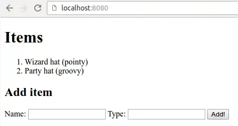

# Exercise 02 05: Hello Objects

There is an application in the task base that deals with `Item`-type entities.

Your task is to add the following additional functionality to the application:

* When the user opens the root path of the application with the
  browser (ie makes a GET-type request to the root path of the
  application), he should see a list of objects in addition to the
  existing form.  Each object must have its name (name) and type (type).

In the example below, in addition to the existing magician's hat [ , a Party hat ](https://en.wikipedia.org/wiki/Party_hat) has been added to the application .



---

---

## The Lombok project and reducing boilerplate

We'll get to know how to display objects on pages.  Before that, however, let's take a look at a rather clever library.

By
default, classes that describe data objects in Java need constructors
as well as getters and setters.  For example, Thymeleaf uses the get
methods of the class when completing HTML pages.

Even a very simple class — like the one below describing the event `Event`— contains a lot of program code.

```java
public class Event {

    private String name;

    public Event() {
    }

    public Event(String name) {
        this.name = name;
    }

    public String getName() {
        return this.name;
    }

    public void setName(String name) {
        this.name = name;
    }
}
```

Most of the program code is relevant due to prevailing practices — for
example Thymeleaf needs getters — but at the same time irrelevant.  As
the number of classes described above and their attributes increase,
projects will eventually have hundreds if not thousands of lines of
"useless" source code.  Such frequently repeated, similar code is called
boilerplate.

[Lombok ](https://projectlombok.org/) is a library designed to reduce the number of duplicate constructors,
getters, and setters in projects.   Lombok can be used by the project by
adding the project `pom.xml`file of the lombok dependency.

```xml
<dependency>
    <groupId>org.projectlombok</groupId>
    <artifactId>lombok</artifactId>
    <scope>provided</scope>
</dependency>
```

The project offers the possibility of automatic creation of getters and
setters so that the programmer does not have to define them himself.
From the programmer's point of view, the class described above `Event`works exactly the same if constructors and methods are removed and a few annotations are added to the class.

```java
import lombok.AllArgsConstructor;
import lombok.Data;
import lombok.NoArgsConstructor;

@NoArgsConstructor
@AllArgsConstructor
@Data
public class Event {
    private String name;
}
```

The annotations used above work as follows: Annotation `@NoArgsConstructor`creates a parameterless constructor for the class, annotation `@AllArgsConstructor`creates a constructor containing all attributes for the class, and an annotation `@Data`create getters, setters, `equals`-method, `hashcode`-method, and `toString`-method.


**You need to install the Lombok plugin in VS Code!!! [https://marketplace.visualstudio.com/items?itemName=vscjava.vscode-lombok](https://marketplace.visualstudio.com/items?itemName=vscjava.vscode-lombokhttps:/)**

## Processing of objects

In addition to collections, other types of objects can also be added to
the model.  Let's assume that we have a class that describes a person.

```java
// importit

@NoArgsConstructor
@AllArgsConstructor
@Data
public class Henkilo {
    private String nimi;
}
```

Adding a person object is straightforward:

```java
@GetMapping("/")
public String home(Model model) {
    model.addAttribute("henkilo", new Henkilo("Le Pigeon"));
    return "index";
}
```

When the page is created, the person is accessed based on the key set in the
model.  The "Le Pigeon" person created above is stored with the key
"person".  As before, the object can be accessed with the key.

```xml
<h2 th:text="${henkilo}">Henkilön nimi</h2>
```

When we try the above person printing, we can see an object `toString`the value returned by the -method.

We get access to object variables `get*Muuttuja*`through methods.  If we want to print the one related to the Person object `nimi`-variable, we call the method `getNimi`, which the Lombok project automatically generates for us if the class is defined `@Data`-annotation.  In the notation used by Thymeleaf, the call transforms into a form `henkilo.nimi`.  So we get the desired output in the following way:

```xml
<h2 th:text="${henkilo.nimi}">Henkilön nimi</h2>
```

## Objects in the list

In terms of basic syntax `th:each`already became familiar a while ago: going through the list in Thymeleaf takes place with an attribute `th:each`through.
Its definition gets the name of the variable in which the item to be
taken from the collection is stored at each iteration, as well as the
collection to be traversed.

```xml
<p th:each="alkio : ${lista}">
    <span th:text="${alkio}">hello world!</span>
</p>
```

The properties of the elements of an iterable set can be accessed in
exactly the same way as the properties of other objects.  Let's examine
the following example where two people are added to a list, the list is
added to a request, and finally a view is created using Thymeleaf.

```java
package henkilot;

import java.util.List;
import java.util.ArrayList;
import org.springframework.stereotype.Controller;
import org.springframework.ui.Model;
import org.springframework.web.bind.annotation.GetMapping;

@Controller
public class HenkiloController {
    private List<Henkilo> henkilot;

    public HenkiloController() {
        this.henkilot = new ArrayList<>();
        this.henkilot.add(new Henkilo("James Gosling"));
        this.henkilot.add(new Henkilo("Martin Odersky"));
    }

    @GetMapping("/")
    public String home(Model model) {
        model.addAttribute("list", henkilot);
        return "index";
    }
}
```

```xml
<p>Ja huomenna puheet pitävät:</p>
<ol>
    <li th:each="henkilo : ${list}">
        <span th:text="${henkilo.nimi}">Esimerkkihenkilö</span>
    </li>
</ol>
```

The page sent to the user looks like the following after processing on the server.

```xml
<p>Ja huomenna puheet pitävät:</p>
<ol>
    <li><span>James Gosling</span></li>
    <li><span>Martin Odersky</span></li>
</ol>
```
