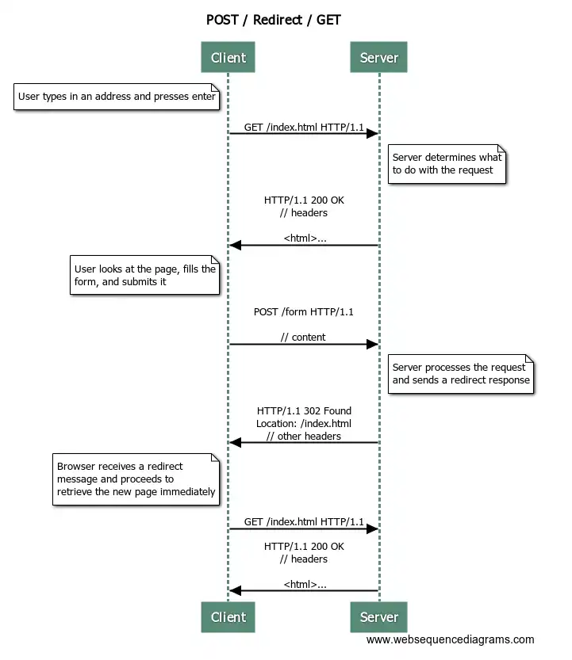

# Exercise 02 07: Hello Post/Get/redirect


The task base has both a notepad listing functionality
and a form that can be used to send POST-type requests to the server.
Implement functionality in the application, where the server listens to
POST-type requests, adds the information coming in connection with the
request to the list in the application, and redirects the user to the
root address of the GET-type request.

There are no tests in the assignment.  Return the task when the program works as defined by the task assignment.

---


## Post/Redirect/Get design pattern

When data is sent to the server `POST`-type
request, the request parameters are passed in the request body.  If the
form of the task above sends information to the server, for example the
string "Hello world!", the request in HTTP format is as follows.

```
POST / HTTP/1.1
 Host: localhost:8080
 // other headers

 content=Hello world!

 
```

In the previous task, the method handling the POST request returned the string "redirect:/".  What was this really about?

Actually,
all requests that send information to the server are problematic if the
displayed page is returned as a response to the request.  In this case,
when reloading the page (e.g. by pressing F5), the user may
accidentally resend the previously sent data.

The functionality
of the server that receives data must be implemented in such a way that
after processing the sent data, a redirection request is returned to
the user as a response.   After this, the user's browser makes a new
request to the path given with the redirection request.   This method of
implementation is called [ the Post/Redirect/Get ](http://en.wikipedia.org/wiki/Post/Redirect/Get) planning model and it e.g.   resubmission of forms is prevented, which also reduces the repetition of functionality.

Below
is an implemented path that listens to a POST-type request, as well as
the related functionality.  A POST type request is defined by an
annotation `@PostMapping`through.  By returning a string from the method that handles the request `redirect:/`is told that a redirection request to the path should be sent in response to the request `"/"`.
When the browser receives a redirection request, it makes a GET-type
request to the address given in the redirection request.

```java
package uudelleenohjaus;

import java.util.List;
import java.util.ArrayList;
import org.springframework.stereotype.Controller;
import org.springframework.ui.Model;
import org.springframework.web.bind.annotation.GetMapping;
import org.springframework.web.bind.annotation.PostMapping;
import org.springframework.web.bind.annotation.RequestParam;

@Controller
public class RedirectOnPostController {

    private String message;

    @GetMapping("/")
    public String home(Model model) {
        model.addAttribute("message", message);
        return "index";
    }

    @PostMapping("/")
    public String post(@RequestParam String content) {
        this.message = content;
        return "redirect:/";
    }
}
```

The sequence diagram below shows the submission of the form using the POST /
Redirect / GET model.  First, the user enters the desired address in
the browser and presses enter.  As a result, the browser makes a
GET-type request to the server.  The server returns an HTML page in
response — we assume that the HTML page also contains a form.  The user
fills out the form on the HTML page and presses the submit button of the
form.  The browser makes a POST-type request to the server.  The body
of the request contains the information filled in by the user in the
form.  The server receives the request, processes it, and sends a
redirection request in response.  The response to the request is not
shown to the user, but the browser automatically makes a new GET-type
request to the address indicated by the redirection request.  In
response, the server returns an HTML page that is displayed to the user.



