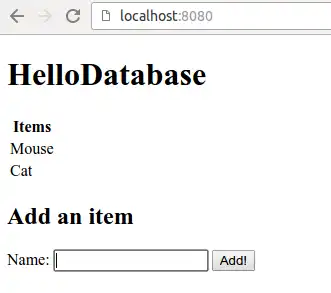

# Exercise 02 08: Item Database

this task is already implemented in the
database functionality and retrieval of objects from the database. More
functionality in the application that allows you to store objects
objects to the database using a predefined form.

Implement method appropriate to the controller class (check the parameter or
parameter names in the HTML page) and use the ItemRepository
interface.

Below is an example of an application when a few rows have been added to the database:



Note! Do not edit the HTML page in the mission statement.

Application creates by default database files in the root path of the task pool
database.mv.db and database.trace.db. If you want to clear the database,
delete these files and restart the application (or,
alternatively, add the delete functionality to the program..)

---

---


The database tables and categories are very similar.
Database tables define columns and reference keys, classes define columns and reference keys.
define attributes and references. It is probably not surprising that
database tables are often described in terms of classes.

Relational databases
and object programming lies the need for a system of objects
into database table rows and back again. This is done using ORM ([Object-relational mapping](https://en.wikipedia.org/wiki/Object-relational_mapping)) programming techniques, for which a significant number of off-the-shelf tools and libraries are available.

ORM tools
provide the software developer with, among other things, the functionality to
to create database tables from classes, but they also facilitate
query generation and manage references between classes.
In the best case, the developer is left with the responsibility for the application
the implementation of the queries necessary for the application only to the extent that
ORM frameworks do not already provide.

Relational databases
a number of ORM applications are available for handling relational databases in Java. Oracle/Sun standardises
the storage of objects in relational databases using the [JPA](http://en.wikipedia.org/wiki/Java_Persistence_API) (Java Persistence API) standard. Libraries implementing JPA (e.g. [Hibernate](http://www.hibernate.org/)) abstract the relational database and facilitate querying directly from the program code.

Since
much of the database functionality is very similar to the
("save", "load", "delete", ...), the basic functionality can be
can be practically hidden from the programmer. In this case, the programmer is left with
the task of defining the classes that often describe the database tables and the
interfaces corresponding to database queries. See
this in the next section.

The database functionality can be
application by adding the following dependencies to the application.
As before, the dependencies are predefined in the task pools.

```xml
<dependency>
    <groupId>org.springframework.boot</groupId>
    <artifactId>spring-boot-starter-data-jpa</artifactId>
</dependency>
<dependency>
    <groupId>com.h2database</groupId>
    <artifactId>h2</artifactId>
</dependency>
```

Database
are also defined in such a way that the application
by default creates the database files `database.mv.db` and `database.trace.db` in the root path of the task tree. These definitions can be found in the `application.properties` file in the `src/main/resources` folder of the task tree.

If
want to clear the database, delete these files and start
application again. Alternatively, you can always execute the program
functionality to clear the database.

## Specifying a class to save

According to the JPA standard, each class to be stored in the database must have an annotation `@Entity` and an `@Id` annotation
attribute, which acts as the master key in the database table. The JPA
the primary key is typically numeric (`Long` or `Integer`). In addition to these, the class must implement a `Serializable` interface - this requires nothing more than the `implements Serializable` part of the class definition. Such classes defining a database table are called entities.

A numeric master key may also have an annotation `@GeneratedValue(strategy = GenerationType.AUTO)` defined, which gives responsibility for generating the values of the master key for the database. The class to be stored in the database table looks like the following:

```java
// pakkaus

import java.io.Serializable;
import javax.persistence.Entity;
import javax.persistence.GeneratedValue;
import javax.persistence.GenerationType;
import javax.persistence.Id;

@Entity
public class Henkilo implements Serializable {

    @Id
    @GeneratedValue(strategy = GenerationType.AUTO)
    private Long id;
    private String nimi;

    // getterit ja setterit
```

The names of the columns and database tables created in the database can be edited using the annotations `@Column` and `@Table`.

```java
// pakkaus

import java.io.Serializable;
import javax.persistence.Column;
import javax.persistence.Entity;
import javax.persistence.GeneratedValue;
import javax.persistence.GenerationType;
import javax.persistence.Id;
import javax.persistence.Table;

@Entity
@Table(name = "Henkilo")
public class Henkilo implements Serializable {

    @Id
    @GeneratedValue(strategy = GenerationType.AUTO)
    @Column(name = "id")
    private Long id;
    @Column(name = "nimi")
    private String nimi;
    // getters and setters
```

Above
class defines a database table called "Person", which has a
columns "id" and "name". By default, the table and column names are
are created based on the variable names, so the above definition is not
doesn't really change anything.

The application framework infers
column types automatically based on the variable types.
However, these can be influenced - for example, by the
in the database can be influenced by the `@Column` annotation with the `length` attribute.

Spring Data JPA's [AbstractPersistable](http://docs.spring.io/autorepo/docs/spring-data-jpa/current/api/org/springframework/data/jpa/domain/AbstractPersistable.html) class
the definition of the above class shrinks slightly. Top class
AbstractPersistable defines the master key, in addition to which the class
also implements the Serializable interface.

```java
// pakkaus ja importit

@Entity
@Table(name = "Henkilo")
public class Henkilo extends AbstractPersistable<Long> {

    @Column(name = "nimi")
    private String nimi;
    // getterit ja setterit
```

If the annotations of the database table and columns are not explicitly
are explicitly defined, their names are inferred from the class and variable names.

```java
// packaging and imports

@Entity
public class Henkilo extends AbstractPersistable<Long> {

    private String nimi;
    // getters and setters
```

Since we also use the Lombok project, our class doesn't really even need getters or setters.

```java
// packaging and imports

@Entity
@NoArgsConstructor
@AllArgsConstructor
@Data
public class Henkilo extends AbstractPersistable<Long> {

    private String nimi;
}
```

The above class defines a database table with a column named `id` as the primary key. Above, the type of the master key is set to `Long` (`... extends AbstractPersistable<Long>`). The values of the master key are generated automatically. In addition, the database table has a string column `name`. The class also has constructors, getters, setters, hashCode, equals, and toString methods.

## Interface to database processing

Once we have a class describing a database table, we can create a *interface* for database processing. Using the Spring application framework and the JPA standard, our interface for database processing inherits a ready-made `JpaRepository` interface that defines the normal CRUD functionality (create, read, update, delete) and a set of other methods.

For the inherited `JpaRepository` interface
is given two type parameters. The first type parameter
is used to specify the class describing the database table and the second type parameter
is the type of the main key of the database table.

Let us call this interface pool `PersonalRepository`. In the example, it is assumed that the class `Person` is located in the package `domain`.

```java
// pakkaus

import domain.Henkilo;
import org.springframework.data.jpa.repository.JpaRepository;

public interface HenkiloRepository extends JpaRepository<Henkilo, Long> {

}
```

Email make the interface a concrete implementation. Spring automatically creates
an instance of the interface when our application is started.

### Bringing a database handler into the controller

Once we have created the interface `PersonRepository`,
we can add it to the controller class. This is done by specifying
an instance of the interface describing the database abstraction in the controller
as the olivariable of the controller. In addition, the annotation `@Autowired` is set to the olivevariable. This `@Autowired`
is related to the terms Inversion of
Control and Dependency Injection. At startup, Spring creates an entity implementing the `PersonRepository` interface, which it then injects into the `PersonRepository` variables marked with the `@Autowired` annotation.

```java
// ...

@Controller
public class HenkiloController {

    @Autowired
    private HenkiloRepository henkiloRepository;

    // ...
}
```

Now the database can be accessed via the `PersonRepository`-olio. See the [JpaRepository](http://docs.spring.io/spring-data/jpa/docs/current/api/org/springframework/data/jpa/repository/JpaRepository.html) class
API, which contains descriptions of the methods provided by the interface. Note,
that JpaRepository inherits, among other things, the CrudRepository interface, whose methods
are also used by our programs.

For example, we can implement the listing of entities in the database and the addition of a single entity as follows.

```java
// ...

@Controller
public class HenkiloController {

    @Autowired
    private HenkiloRepository henkiloRepository;

    @GetMapping("/")
    public String list(Model model) {
        model.addAttribute("list", henkiloRepository.findAll());
        return "henkilot"; // tässä oletetaan erillinen tiedosto henkilot.html
    }

    @PostMapping("/")
    public String create(@RequestParam String nimi) {
        henkiloRepository.save(new Henkilo(nimi));
        return "redirect:/";
    }
}
```
