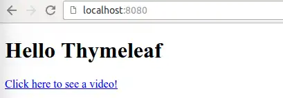

# Exercise 02 01

Implement the following functionality:

Request for root path / returns to the user with Thymeleaf in the folder src/main/resources/templates/to be index.html file.
A request for a path /video returns to the user with Thymeleaf in the folder src/main/resources/templates/to be video.html file.
Below is an example of the program's operation when a request to the root path of the application has been made with the browser.



---

---

Our applications have received a request coming to a
certain path and returned information in string format to the user. The
server can also create a view for the user, which the browser
eventually displays to the user.

The views are typically created with the help of auxiliary libraries in such a way
that the programmer creates the HTML views and embeds library-specific
commands in the HTML code.  These commands enable e.g. adding information to the pages.

Such HTML pages, in which library-specific commands
for adding information are embedded, are called view templates
(hereafter template).

The tool we use in this course to create a view is [ Thymeleaf ](http://www.thymeleaf.org/), which provides tools for adding data to HTML pages.

In practice, when creating views, an HTML page is first created, and then commands
are added to the page for Thymeleaf to process.

Thymeleaf pages ("templates") are located in the project folder `src/main/resources/templates`or in the folders below it.

### Introducing Thymeleaf

Deploying Thymeleaf requires adding a new dependency (ie a library or libraries). `pom.xml`file `dependencies`- section.  When we add `dependencies`-section of dependency `spring-boot-starter-thymeleaf`, we get to use Thymeleaf.

```xml
<dependency>
    <groupId>org.springframework.boot</groupId>
    <artifactId>spring-boot-starter-thymeleaf</artifactId>
</dependency>
```

In VS Code, you can also right-click the pom.xml file -> add starter -> choose thymeleaf -> select starters.

The assignment-based definition has been completed.

The example below creates a root path `/`listening
application.  When a request is made to the application, an HTML page
is returned which is processed by Thymeleaf.  Spring infers the page to
process and return based on the string.  Below method returns a string `"index"`, in which case Spring will search the folder `src/main/resources/templates/`page `index.html`.  When the page is found, it is given to Thymeleaf for processing, after which the page is returned to the user.

```java
package thymeleaf;

import org.springframework.stereotype.Controller;
import org.springframework.web.bind.annotation.GetMapping;

@Controller
public class ThymeleafController {

    @GetMapping("/")
    public String home() {
        return "index";
    }
}
```

Unlike before, the request handling method has no annotation `@ResponseBody`.  If the method had an annotation `@ResponseBody`, would return the string "index" to the user.

When the annotation `@ResponseBody`is not defined for the method, Spring knows that the returned string is related to the view displayed to the user.  The project `pom.xml`in the file `spring-boot-starter-thymeleaf`because
of the dependency, Spring knows more precisely that it is a view to be
processed by the Thymeleaf library — so it looks for the file associated
with the "index" string and gives it to Thymeleaf to process.  The
final result is then directed to the user.
