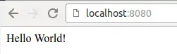
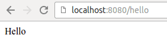
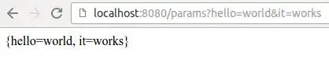

# Exercise 01

When the server receives a request for any path, the server should return the string "Hello World!"

# Exercise 02

Implement in packaging `hellopath`to the existing class `HelloPathController`the following functionality:

* A request for a path`/path`returns the string "Correct!"

# Exercise 03

Implement in packaging `hellopaths`to the existing class `HelloPathsController`the following functionality:

* A request for a path`/hello`returns the string "Hello" to the user
* A request for a path`/paths`returns the string "Paths" to the user

The picture below shows an example of a situation where the browser has made a request to the path `/hello`

# Exercise 04

Implement in packaging `hellorequestparam`to the existing class `HelloRequestParamController`the following functionality:

* A request for a path`/hello`returns the string "Hello " appended to the user`param`the value contained in the named parameter.

# Exercise 05

Implement in packaging `greeting`to the existing class `GreetingController`the following functionality:

* A request for a path`/greet`get the parameters`name`and`greeting`.
  As a response to the request, a string is returned, which first
  contains the greeting and then the name.  These are separated by a
  comma.

For example, a request `/greet?greeting=Greetings&name=Earthling`returns a string `Greetings, Earthling`.  Accordingly, the request `/greet?greeting=Oi&name=Mate`returns a string `Oi, Mate`.  The order of the parameters does not matter.

# Exercise 06

Implement in packaging `hellorequestparams`to the existing class `HelloRequestParamsController`the following functionality:

* A request for a path`/hello`returns the string "Hello " appended to the user`param`the value contained in the named parameter.
* A request for a path`/params`returns to the user the names and values of all parameters that come with the request.

The picture below shows an example of a situation where the browser has made a request to the path `/params?hello=world&it=works`

# Exercise 07

Implement this task in the package `square`located `SquareController`-category the following functionality:

* A request for a path`/square`counts as a parameter`num`the
  second power of the value of the variable to be obtained and returns it
  to the user.  Note that the value is a number, and it should also be
  treated as a number.

# Exercise 08

Implement this task in the package `calculator`located `CalculatorController`-category the following functionality:

* A request for a path`/add`calculates the parameters`first`and`second`values
  together and returns the answer to the user.  Note that the values
  are numbers, and they should also be treated as numbers.
* A request for a path`/multiply`tells the parameters`first`and`second`values and returns a response to the user.
